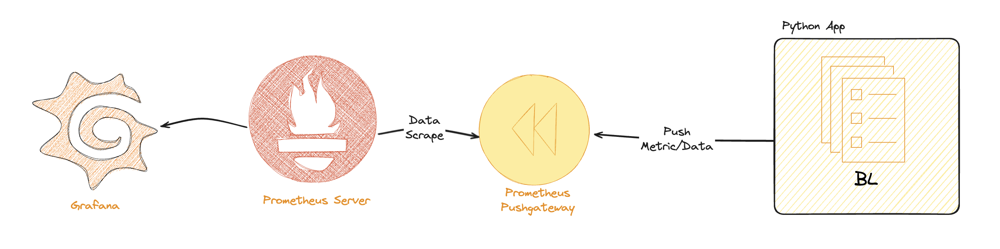

# Push Metrics to Prometheus using Prometheus Pushgateway



## Prometheus Pushgateway

The Prometheus Pushgateway is an intermediary service that allows ephemeral and batch jobs to push their metrics to Prometheus. It is useful for scenarios where the application or job does not run continuously and cannot be scraped by Prometheus directly.

### Use Cases

- **Batch Jobs**: Collect metrics from jobs that run periodically or on-demand and push them to the Pushgateway.
- **Ephemeral Jobs**: Track metrics from short-lived jobs that may not exist long enough for Prometheus to scrape them.
- **CI/CD Pipelines**: Push metrics from build and deployment pipelines to monitor their performance and success rates.
- **Custom Metrics**: Push custom application metrics that are not exposed via a standard Prometheus exporter.

By using the Pushgateway, you can ensure that metrics from these types of jobs are available to Prometheus for monitoring and alerting.

## Prerequisites

- Docker
- Python 3.13

## Setup

1. Clone the repository:
    ```sh
    git clone <repository-url>
    cd <repository-directory>
    ```

2. Create and activate a Python virtual environment:
    ```sh
    python3 -m venv venv
    source venv/bin/activate
    ```

3. Install the required Python packages:
    ```sh
    pip install -r requirements.txt
    ```

## Running the Project

1. Start the Prometheus and Pushgateway containers using Docker Compose:
    ```sh
    docker-compose up -d
    ```

2. Run the Python script to push metrics to the Pushgateway:
    ```sh
    python push.py
    ```

## Configuration

- [prometheus.yml](http://_vscodecontentref_/0): Configuration file for Prometheus.
- [docker-compose.yml](http://_vscodecontentref_/1): Docker Compose file to set up Prometheus and Pushgateway containers.
- [push.py](http://_vscodecontentref_/2): Python script to push custom metrics to the Pushgateway.

## Commands

Refer to [commands.txt](http://_vscodecontentref_/3) for additional Docker commands to run Prometheus and Pushgateway containers.

## License

This project is licensed under the MIT License.